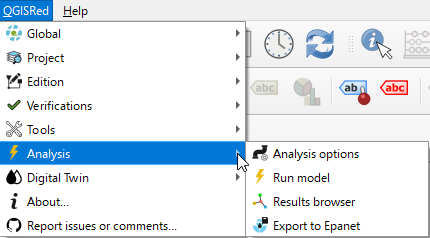

# 📊 Simulation and Results

Once the network is defined, QGISRed allows hydraulic and water quality simulations to be carried out using the EPANET engine.

### In this section:
* [Model execution](execution.md)
* [Results viewer](results.md)

> ❗ **IMPORTANT**:
> Before simulating, it is advisable to pass the topology [Verifications](../verifications/README.md).