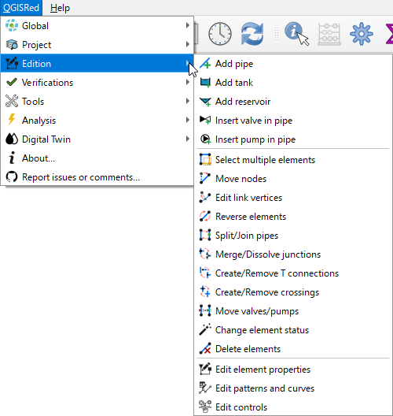

# 🏗️ Editing Tools

QGISRed allows you to build your water network visually and intuitively directly on the QGIS map.

### What can you do?
* [Creation of basic elements](creation.md) (Pipes, nodes, tanks).
* [Graphic manipulation](manipulation.md) (Move nodes, edit vertices).
* [Editing properties](properties.md) (Diameters, materials, roughness).

---
> 💡 **TIP**:
> When creating a pipe, QGISRed automatically generates the end nodes if they do not exist.