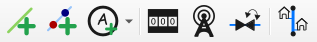

# Creation of Elements

Use the QGISRed toolbar to build your network. The buttons are designed to automate the topology.

### Construction Mechanics

#### 1. Pipes 
* **Creation**: Click to set the start and end point. Two extreme nodes (type *Junctions*) will automatically be generated.
* **Properties**: When creating a pipeline, it is automatically assigned the project's default values.

#### 2. Tanks and Reservoirs  
* **Requirement**: You must click on an existing junction. QGISRed does not allow creating isolated nodes of this type; They must always be linked to the network.

#### 3. Valves and Pumps  
* **Inline Insertion**: Select the tool and click on an existing pipe. 
* **Smart split**: The plugin will split the original pipe into two sections or shorten it to insert the new element while maintaining connectivity.

---
> ❗ **IMPORTANT**:
> Unlike other EPANET editors, in QGISRed you **do not need to manually define the start and end node IDs**. The plugin uses spatial analysis to connect lines and nodes automatically.