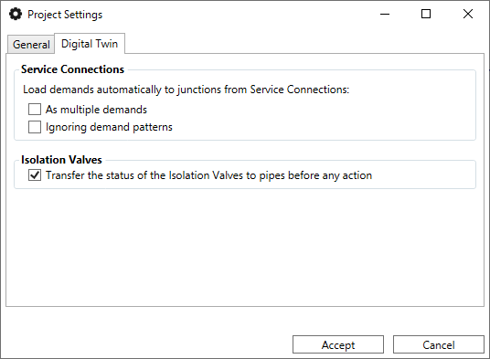

# Example 2: Network Creation from Scratch

This tutorial shows how to build the "Red1_SI" model by drawing each element directly on the map.

### 1. Preparation
* **Create Project**: Use `Project > Create Project`, define the name and CRS (ex: WGS 84).
* **Self-assembly (Snapping)**: Activate the QGIS magnet so that the pipes connect exactly at the nodes.

### 2. Layout Drawing
1. **Pipes**: Select the add pipe tool and draw the diagram. Right click to finish each section.
2. **Knots and Tanks**: Add the specific elements on the ends of the pipes.
3. **Valves**: Insert the regulation elements on the existing lines.

### 3. Data Entry
* Use the **Properties Editor** to click on each element and assign diameters, roughnesses and base demands.
* **Collect Curves**: Access the curve manager to define the characteristic curve of the pump (Flow-Head) and the demand pattern.

### 4. Validation and Execution
1. **Validate**: Press the Verify button to automatically create the missing nodes and consolidate the topology.
2. **Rules and Controls**: Defines control laws (e.g., turning off the pump if the tank level is > 5m).
3. **Simulate**: Run the model and verify that the results match the expected design.

