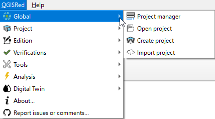

# 🗂️ General

La barra **General** es el punto de entrada a cualquier sesión de trabajo con QGISRed. Contiene las cuatro acciones para gestionar el ciclo de vida de los proyectos: crearlos, abrirlos, importarlos y administrar el historial.


*Barra General: Gestor de proyectos, Abrir, Crear e Importar.*

---

## Qué es un proyecto QGISRed

Un proyecto QGISRed es una **carpeta** que contiene un conjunto de archivos SHP y DBF con el mismo prefijo (el nombre de la red). Por ejemplo, para una red llamada `RedUrbana`:

```
RedUrbana/
├── RedUrbana_Junctions.shp/.dbf/.shx/.prj
├── RedUrbana_Pipes.shp/.dbf/.shx/.prj
├── RedUrbana_Tanks.shp/.dbf/.shx/.prj
├── RedUrbana_Reservoirs.shp/.dbf/.shx/.prj
├── RedUrbana_Valves.shp/.dbf/.shx/.prj
├── RedUrbana_Pumps.shp/.dbf/.shx/.prj
├── RedUrbana_Options.dbf
├── RedUrbana_Title.dbf
├── Issues/
├── Queries/
└── Results/
```

> ⚠️ Nunca muevas, renombres ni borres estos archivos manualmente desde el explorador de Windows. Usa siempre las herramientas de QGISRed para garantizar la coherencia del conjunto.

## En esta sección

* [Gestor de proyectos](gestor-proyectos.md) — historial, clonar, renombrar, borrar
* [Crear proyecto](crear-proyecto.md) — proyecto nuevo desde cero
* [Abrir e importar](abrir-importar.md) — abrir existente o importar desde `.inp`
