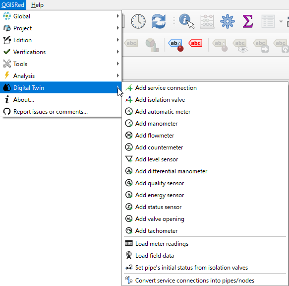

# Configuración del Proyecto

La barra **Project** agrupa tres diálogos de configuración que afectan al comportamiento hidráulico del modelo y a los valores por defecto con que se crean los nuevos elementos.

---

## Opciones del proyecto

**Barra Project → Opciones del proyecto** (Project settings)

Abre el diálogo principal de opciones de EPANET. Es equivalente a la sección `[OPTIONS]` del archivo `.inp`.


*Diálogo de Opciones del proyecto con sus cuatro pestañas.*

### Pestaña Hidráulica

| Campo | Descripción |
|-------|-------------|
| **Unidades de caudal** | Define el sistema de unidades del proyecto. Unidades métricas (LPS, LPM, MLD, CMH, CMD) corresponden a SI; galones y pies cúbicos (CFS, GPM, MGD, IMGD, AFD) a US |
| **Fórmula de pérdida de carga** | Darcy-Weisbach (D-W), Hazen-Williams (H-W) o Chezy-Manning (C-M) |
| **Gravedad específica** | Peso específico del fluido respecto al agua pura (1.0 para agua estándar) |
| **Viscosidad relativa** | Factor sobre la viscosidad cinemática del agua a 20 °C |
| **Precisión** | Criterio de convergencia del solver hidráulico |
| **Modelo de demanda** | DDA (Demand Driven) o PDA (Pressure Driven) — en PDA, la demanda se reduce si la presión cae por debajo de un umbral |
| **Presión mínima / nominal** | Umbrales para el modelo PDA |
| **Máx. iteraciones / ratio** | Parámetros de convergencia del solver |

> 💡 Cambiar las **unidades de caudal** no convierte los valores ya introducidos. Si la red está definida en LPS y cambias a GPM, todos los valores de demanda, caudal y longitud deberán actualizarse manualmente.

### Pestaña Calidad

| Campo | Descripción |
|-------|-------------|
| **Tipo de análisis de calidad** | Ninguno (no simula calidad), Chemical (reactivo), Age (edad del agua), Trace (trazador) |
| **Etiqueta del reactivo** | Nombre del producto modelado (p. ej., "Cloro") — aparecerá en los resultados |
| **Nudo trazador** | Para análisis de tipo Trace, ID del nudo fuente del trazador |
| **Unidades de concentración** | mg/L o μg/L |
| **Difusividad** | Coeficiente de difusión molecular relativa (1.0 para cloro en agua) |
| **Tolerancia** | Criterio de convergencia para el solver de calidad |

### Pestaña Tiempos

| Campo | Descripción |
|-------|-------------|
| **Duración de la simulación** | Tiempo total de la simulación. Formato `HH:MM:SS` o en horas (p. ej., `24:00:00`) |
| **Paso de tiempo hidráulico** | Intervalo de cálculo hidráulico (típicamente 1 h) |
| **Paso de tiempo de calidad** | Intervalo de cálculo de calidad (típicamente 5 min) |
| **Paso de tiempo de reporte** | Frecuencia con que se guardan resultados (determina el número de instantes disponibles en el Visor) |
| **Hora de inicio de simulación** | Hora del reloj a la que corresponde el instante 0 de la simulación |
| **Tipo de estadístico** | None (todos los instantes), Average, Minimum, Maximum, Range |

> 💡 Un **paso de reporte** de 1 h en una simulación de 24 h genera 25 instantes de resultado (0 h a 24 h). Pasos más cortos aumentan la resolución temporal pero también el tamaño de los archivos de resultado.

### Pestaña Energía

Permite definir el coste energético de las bombas para el análisis de consumo:

| Campo | Descripción |
|-------|-------------|
| **Precio global** | Coste por kWh (en la moneda definida) |
| **Patrón de precio** | Patrón temporal de variación del precio de la electricidad |
| **Eficiencia global** | Eficiencia media de las bombas (si no tienen curva de eficiencia individual) |

---

## Valores por defecto

**Barra Project → Valores por defecto** (Default values)

Define los valores que se asignan automáticamente a los nuevos elementos al crearlos con las herramientas de edición.


*Diálogo de valores por defecto: parámetros iniciales para cada tipo de elemento.*

### Prefijos de ID

Cada tipo de elemento tiene un prefijo configurable que se usa al generar automáticamente el ID de los nuevos elementos:

| Elemento | Prefijo por defecto | Ejemplo de ID generado |
|----------|---------------------|------------------------|
| Junction | J | J-1, J-2… |
| Pipe | P | P-1, P-2… |
| Tank | T | T-1, T-2… |
| Reservoir | R | R-1, R-2… |
| Valve | V | V-1, V-2… |
| Pump | BM | BM-1, BM-2… |

Los prefijos son configurables. El número inicial también puede establecerse.

### Valores hidráulicos iniciales

| Campo | Descripción |
|-------|-------------|
| **Diámetro por defecto** | Diámetro (mm o pulgadas) asignado a las nuevas tuberías |
| **Rugosidad por defecto** | Coeficiente de rugosidad según la fórmula activa |
| **Cota por defecto** | Cota (m o ft) asignada a los nuevos nudos |
| **Demanda base por defecto** | Demanda inicial de los nuevos nudos de demanda |
| **Velocidad de bomba por defecto** | Factor de velocidad relativa inicial para bombas |

### Tolerancias geométricas

| Campo | Descripción |
|-------|-------------|
| **Tolerancia de nudo** | Distancia máxima (m o ft) para considerar que dos puntos son el mismo nudo |
| **Longitud mínima para división** | Longitud mínima de los tramos resultantes al dividir una tubería |
| **Longitud máxima para división** | Longitud máxima de los tramos resultantes al dividir una tubería |

---

## Tabla de materiales

**Barra Project → Tabla de materiales** (Materials table)

Gestiona la lista de materiales disponibles para las tuberías y sus propiedades de envejecimiento.


*Tabla de materiales con rugosidad inicial e incremento por año.*

### Campos de la tabla

| Campo | Descripción |
|-------|-------------|
| **Código** | Abreviatura del material (p. ej., PVC, DI, AC) |
| **Nombre** | Nombre completo (p. ej., "Ductile Iron", "Asbestos Cement") |
| **Rugosidad inicial** | Coeficiente de rugosidad D-W (mm) en la fecha de instalación |
| **Incremento anual** | Aumento de rugosidad por año de antigüedad (mm/año) |

### Uso con la herramienta "Asignar rugosidades"

Cuando usas la herramienta **Asignar rugosidades** de la barra Tools, QGISRed busca en esta tabla el material de cada tubería y calcula:

```
Rugosidad = Rugosidad_inicial + (Año_actual - Año_instalación) × Incremento_anual
```

> 💡 Puedes añadir materiales personalizados. Los materiales definidos aquí también están disponibles al crear nuevas tuberías desde la barra Edition.

### Materiales incluidos por defecto

QGISRed incluye una tabla de materiales predefinida con los más comunes (CI, DI, AC, PVC, PE, HDPE…). Puedes editarlos o ampliarlos según las características de tu sistema.
