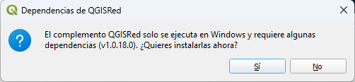

# Gestión de Dependencias

QGISRed necesita un conjunto de librerías de cálculo externas **(las dependencias del plugin de QGISRed)** para poder ejecutar la mayor parte de sus herramientas. Estas librerías son DLLs compiladas en .NET que contienen el motor hidráulico (basado en el toolkit de EPANET 2.3) y los algoritmos de procesamiento geoespacial.

---

## Primera instalación

La primera vez que intentas usar cualquier herramienta de QGISRed, el plugin detecta que las dependencias no están instaladas y muestra un diálogo de confirmación:


*Diálogo de instalación de dependencias: QGISRed solicita permiso para descargar las dependencias.*

- **Sí**: QGISRed descarga e instala las libraries automáticamente. La descarga requiere conexión a internet y puede tardar unos segundos según la velocidad de la conexión.
- **No**: La herramienta no se ejecuta. El diálogo volverá a aparecer la próxima vez que intentes usar el plugin.

> La instalación **no requiere permisos de administrador**. Las DLLs se instalan en la carpeta de usuario `%APPDATA%\QGISRed\`, no en carpetas del sistema.

---

## Dónde se instalan

Las dependencias se almacenan en:

```
C:\Users\{tu_usuario}\AppData\Roaming\QGISRed\
```

Puedes acceder a esta carpeta escribiendo `%APPDATA%\QGISRed` directamente en la barra de direcciones del explorador de Windows.

---

## Actualización de dependencias

Cuando se publica una nueva versión de QGISRed que incluye una versión actualizada de las dependencias, el plugin lo detecta automáticamente al arrancar y propone la actualización con el mismo diálogo de confirmación.

---

## Solución de problemas

**La descarga falla o se interrumpe**

Verifica que tienes conexión a internet y que ningún cortafuegos corporativo bloquea la descarga. Si el problema persiste, contacta al administrador de red para permitir conexiones salientes desde QGIS.

**El plugin muestra el diálogo de dependencias cada vez que se abre**

Significa que las libraries no se instalaron correctamente en sesiones anteriores. Comprueba que la carpeta `%APPDATA%\QGISRed\` existe y contiene archivos `.dll`. Si está vacía, bórrala completamente y vuelve a intentar la instalación.

**El equipo no tiene acceso a internet**

Puedes instalar las dependencias sin conexión si dispones de los archivos necesarios:

1. **ZIP de dependencias**: solicita a alguien con el plugin ya instalado el contenido de su carpeta `%APPDATA%\QGISRed\` (misma versión de QGISRed). Copia esos archivos en tu propia carpeta `%APPDATA%\QGISRed\`.
2. **Instalador de .NET Framework 4.8.1**: descárgalo en otro equipo con internet o solicita el MSI a alguien. Ejecútalo antes de usar el plugin.

Una vez copiadas las DLLs y con .NET Framework 4.8.1 instalado, el plugin funcionará sin haber requerido conexión a internet en ningún momento.
