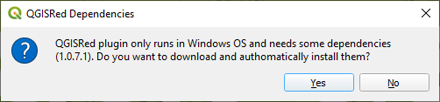

# Dependencies

1.-  Once installed, when the user wants to use some plugin tool, a message will appear indicating the need to install the QGISRed dependencies mentioned above.

2.- Clicking on the "Yes" button will download and install the necessary dependencies for the operation of the plugin (does not require administrator permissions).

3.- In the case of pressing the "No" button, when the user tries again to use any tool of the plugin will indicate the need to install the plugin dependencies.
