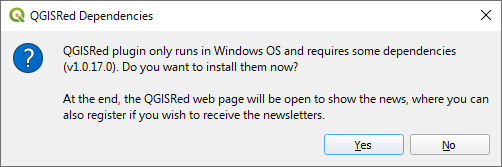

#Dependency Management

When trying to use a QGISRed tool for the first time, you will see a prompt asking you to install additional dependencies.

> 💡 **TIP**:
> These dependencies do not require administrator permissions and are installed automatically.

* If you press **Yes**, the plugin will download the necessary components (`GISRed libraries`).
* If you press **No**, you will not be able to use the analysis tools until you install them.