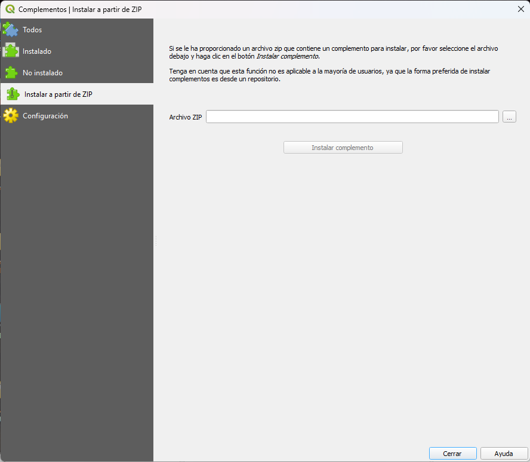

# Installation depuis ZIP Local

Utilisez cette méthode lorsque vous devez installer une version spécifique du plugin qui ne se trouve pas dans le référentiel ou lorsque votre ordinateur n'a pas accès à Internet au moment de l'installation.

---

## Récupérez le fichier ZIP

Téléchargez le fichier `QGISRed.zip` depuis :

- Le dépôt officiel des plugins QGIS (section versions précédentes).
- Le dépôt GitHub du projet.
- Un fichier partagé par l'équipe de développement.

---

## Pas à pas

1. Ouvrez QGIS.
2. Allez dans le menu **Plugins → Gérer et installer les plugins…**
3. Sélectionnez l'onglet **Installer à partir de ZIP**.
4. Cliquez sur le bouton `…` et sélectionnez le fichier `QGISRed.zip`.
5. Cliquez sur **Installer le plug-in**.

<figure><figcaption>
Onglet "Installer depuis ZIP" du gestionnaire de plugins QGIS.
</figcaption></figure>

---

## Avis de sécurité

QGIS affichera un avis indiquant que le plugin ne provient pas du référentiel officiel. Ceci est normal pour toute installation de fichier local. Appuyez sur **Oui** pour poursuivre l'installation.

---

## Remarques

- Si vous avez déjà installé une version précédente de QGISRed, l'installation à partir de ZIP la remplace. Les projets existants ne sont pas concernés.
- Les **dépendances** ne sont pas incluses dans le plugin ZIP. Ils sont téléchargés séparément la première fois que vous utilisez le plugin, tout comme lors d'une installation à partir du référentiel. Si votre ordinateur ne dispose pas d'une connexion Internet, consultez la section [Gestion des dépendances](dependencias.md) pour voir comment les installer manuellement.
- Cette installation **ne reçoit pas de mises à jour automatiques**. Pour mettre à jour, vous devrez répéter le processus avec le ZIP de la nouvelle version.
