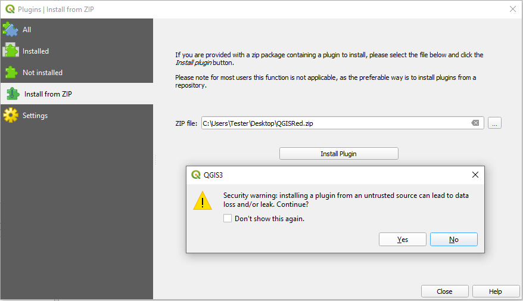

# Installation from ZIP Local

If you have a specific version in an `.zip` file, you can install it manually:

1. Open QGIS.
2. Go to the **Plugins > Manage and Install Plugins...** menu.
3. Select the **Install from ZIP** tab.
4. Find your `QGISRed.zip` file and press **Install Plugin**.

> ⚠️ **WARNING**:
> You will see a QGIS security notice when installing from a local file. Press **Yes** to continue.