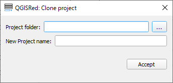

# Project Explorer

QGISRed uses a centralized **Project Manager** to manage your water networks.

### The Project Manager
This window is the heart of file management in the plugin:
* **Recent List**: Double click on any project to open it instantly.
* **Load**: Allows you to link a project that does not appear in the list. You only need the network name and directory.
* **Rename**: Renames the project and automatically updates all linked files.
* **Delete/Unload**: Delete a project from the list or disk.
* **Shortcut**: Button to directly open the project folder in Windows.

### Project Cloning
If you need to create a variant of a network:
1. Press **Clone**.
2. Specify the new name.
3. Choose the directory (several projects can coexist in the same folder if they have different names).

---
> 💡 **TIP**:
> Remember that any plugin tool will work on the files in the project directory, not just what you see open in the QGIS legend.