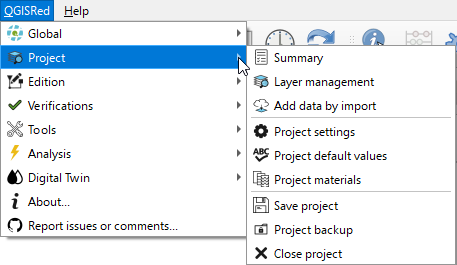
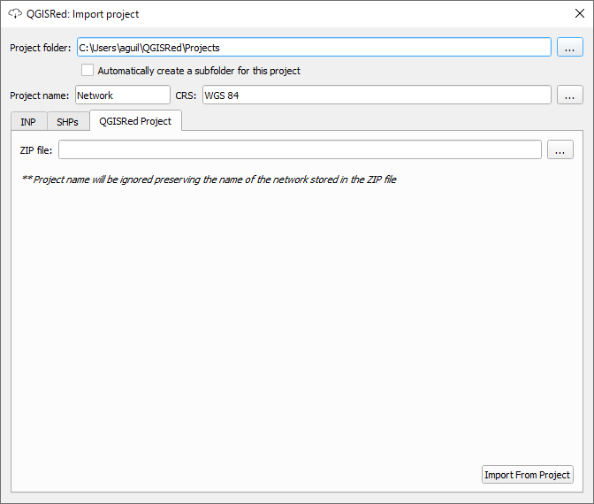

# Layer and Input Management

QGISRed organizes information in a solid relational structure based on SHP files.

### Project Creation (Inputs)
When creating a new project, the plugin automatically generates a group called **"Inputs"** in the QGIS legend.

This group contains at least **6 SHP files**, one for each EPANET base element:
1. **Junctions** (Demand nodes)
2. **Pipes**
3. **Tanks**
4. **Reservoirs**
5. **Valves**
6. **Pumps**

### Advanced Layer Management
The **Layer Management** tool (Project > Layer Management) allows you to:
* Control the visibility of all model layers.
* **Recover deleted layers**: If you accidentally delete a SHP from the project, you can recreate it from here without losing the integrity of the model.
* **Define Projection**: Specify the CRS of the information (Note: this tool does not reproject, it only declares).

### Options and Defaults
From the **Project** menu, you can access:
* **Project Options**: Creator notes, scenario name and settings for the Digital Twin.
* **Default Values**: Prefixes for new elements, minimum clearances and initial hydraulic values.
* **Table of Materials**: Definition of initial roughness and annual increments for automatic calculation based on age.

