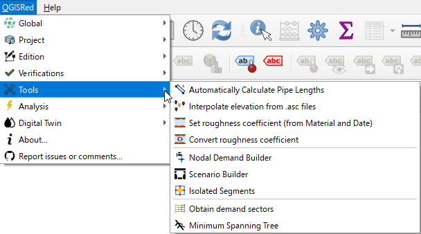

# 🛠️ Advanced Tools

Optimize your model with massive processing tools.

### Featured Features:
* **Elevation Interpolation**: Assigns elevations to all nodes automatically from MDT (ASCII) files.
* **Demand Manager**: Distributes consumption by sectors or proximity to nodes.
* **Roughness Calculation**: Estimates the roughness based on the material and age of the pipe (Hazen-Williams or Darcy-Weisbach).
* **Closed Explorer**: Determines which valves to close to isolate a break.