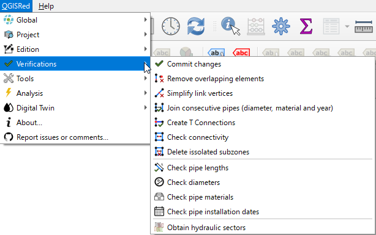

# 🔍 Verifications

QGISRed includes a set of tools to ensure that your model is hydraulically consistent and free of topological errors.

### Main tools:
* **Consolidate Data**: Verifies the integrity of all declared properties.
* **Eliminate Overlapping Elements**: Detects duplicate pipes or nodes in the same position.
* **Simplify Vertices**: Remove unnecessary vertices on straight lines to improve performance.
* **Connectivity Analysis**: Identifies isolated areas and disconnected subnets.

---
> 💡 **TIP**:
> Use **Hydraulic Sectors** (Type A to D) to quickly understand how each part of your network is powered.